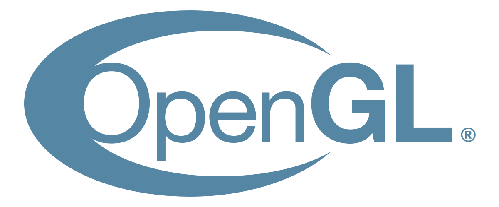

# Bio

- Speak: ***English (UK & US), Russian***
- Programmer & Game developer
- Have been programming for 5 years

 # Skills

 # Learning

 

# Game dev

# Work with

# Credits

pfp: https://ru.pinterest.com/pin/23221754324057594/

