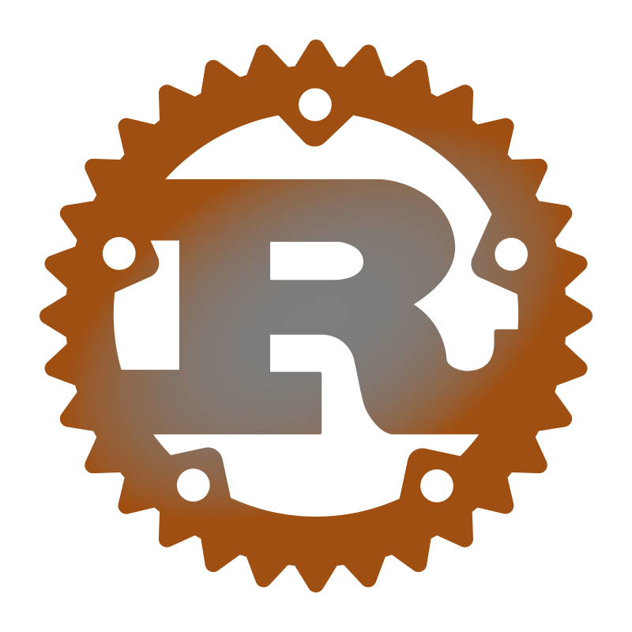

# Bio

- Speak: ***English (UK & US), Russian***
- Programmer & Game developer
- Have been programming for 5 years

 # Skills
</a>
</a>
</a>
</a>

 # Learning
</a>
</a>
</a>
</a> 
</a>

# Game dev
</a>
</a>
</a>
</a>
</a>

# Work with
</a>
</a>
</a>

# Credits

pfp: https://ru.pinterest.com/pin/23221754324057594/

