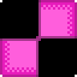

# About me 

- Speak: ***English (UK & US), Russian***
- Programmer & Game developer
- Have been programming for 5 years

 # Skills
</a>
</a>
</a>
</a>

 # I'm learning
</a>
</a>
</a>
</a> 
</a>

# Game development

- I use [**Pygame**](https://pygame.org) and [**Ursina Engine**](https://www.ursinaengine.org/) for my games
- Can also work on engines such as: [**Clickteam Fusion 2.5**](https://www.clickteam.com/clickteam-fusion-2-5), [**Construct 2/3**](https://www.construct.net/en)  

# Work with
</a>
</a>
</a>

---

